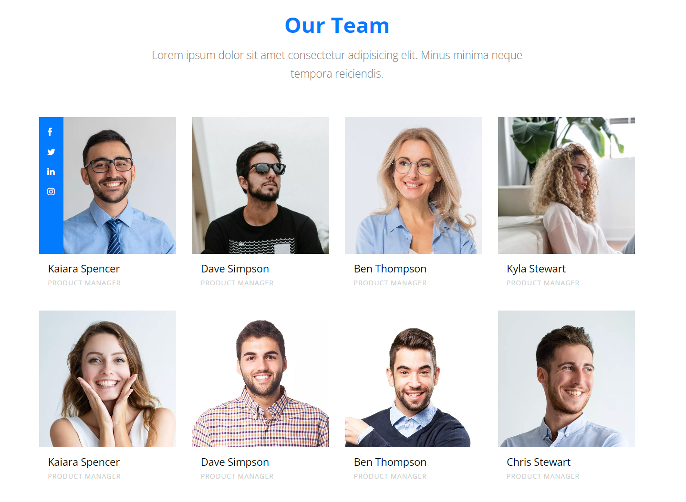

# Uzd

1.

```js
  <p>Total females: </p>
  <p>Persons above 37 years: </p>
  <p>Person with longesnt name: </p>
  <p>Average persons age: </p>
  <p>Total persons age: </p>
  <p>(all hobies atskirti kableliais ir tarpeliais)</p>
```

2.

## Our team sekcija



url: https://preview.colorlib.com/#nitro

1. pasidaryti visa sekcija su komponentais (css mazdaug, labai neuzsizaiskit)
2. generuoti elementus is objektu masyvo.
3. padaryti kad paspaudus ant korteles jos fonas taptu tamsus o tekstas sviesus.
